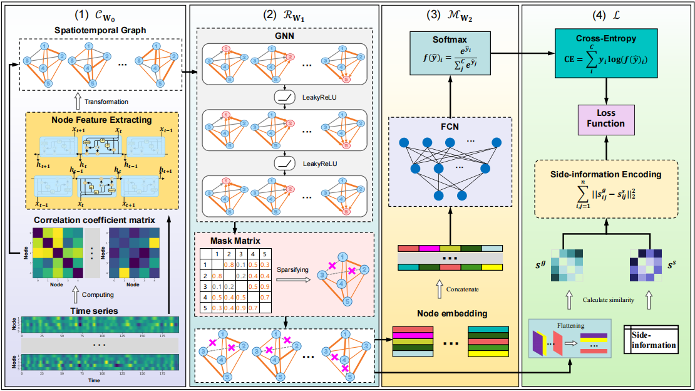

# Robust Spatio-Temporal Graph Neural Networks with Sparse Structure Learning
Yupei Zhang, Yuxin Li, Shuhui Liu, and Xuequn Shang
## Overview
>This paper focuses on the problem of spatio-temporal graph classification by introducing sparse structure learning to enhance its robustness and explainability. Spatio-temporal graph neural networks (STGNN) integrate spatial structure and temporal sequential features into GNN learning, resulting in promising performance in many applications. However, current STGNN models often fail to capture the discriminative sparse substructure and the smooth distribution of these samples. To this end, this paper introduces RostGNN, robust spatio-temporal graph neural networks, for achieving more discriminative graph representations. Concretely, RostGNN extracts the spatial and temporal features by performing gated recurrent units on the given time series data and calculating adjacent matrixes for graphs. Then, we impose the hard-thresholding approach on the final association matrix to obtain a sparse graph. Meanwhile, we calculate a similarity matrix from the side information of samples to smooth the achieved data representations and use fully connected networks for graph classification. We finally applied RostGNN to brain graph classification in experiments on two real-world datasets. The results demonstrate that RostGNN delivers robust and discriminative graph representations and performs better than compared methods, benefiting from the sparsity and manifold regularizers. Besides, RostGNN can potentially yield useful findings for understanding brain diseases.
## RostGNN

## Dataset
>The used datasets in experiments are acquired from the Autism Brain Imaging Data Exchange [(ABIDE)](https://fcon\_1000.projects.nitrc.org/indi/abide) and Attention Deficit Hyperactivity Disorder [(ADHD)](https://fcon\_1000.projects.nitrc.org/indi/adhd200).
Please follow the [instruction](util/abide/readme.md) to download and process this dataset.
## Dependencies
>The code requires Python >= 3.9 and PyTorch >= 1.10.1.
## Usage
### ABIDE 

```bash
python main.py --config_filename setting/abide_fbnetgen.yaml
```

## Hyper parameters

All hyper parameters can be tuned in setting files.

```yaml
model:
  type: fbnetgen
  extractor_type: gru
  graph_generation: product
  embedding_size: 8
  window_size: 8

train:
  method: normal
  pure_gnn_graph: pearson
